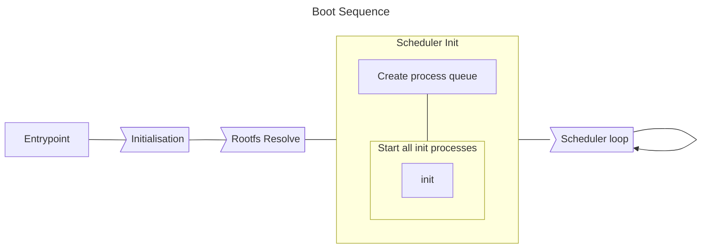
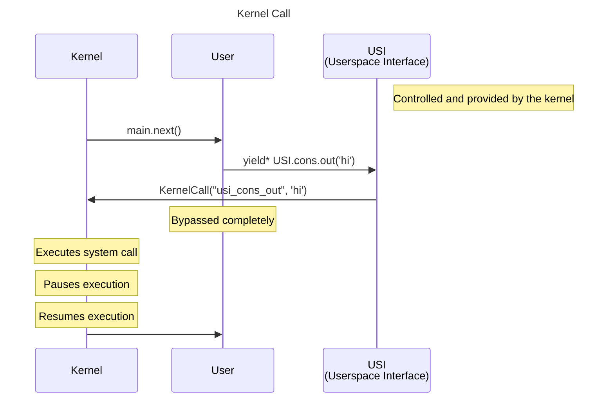
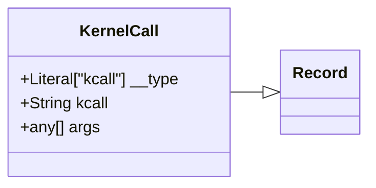
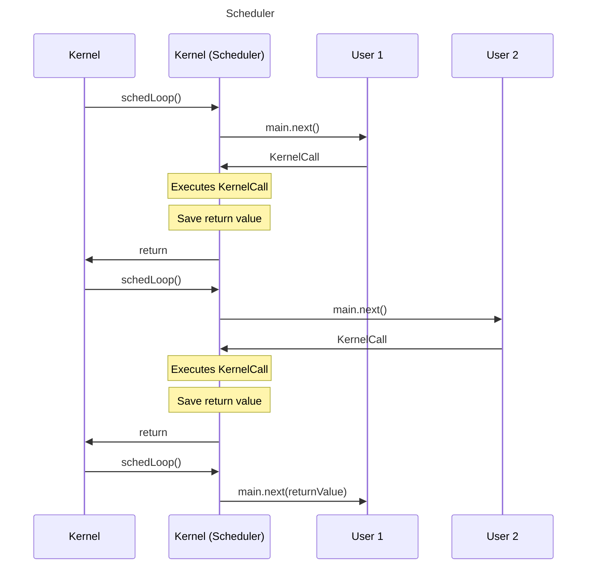

# SilentUOS
A userspace operating system that runs nothing but JavaScript.

## UML

```mermaid
---
title: Boot Sequence
---
flowchart LR;
    Entrypoint --- id1>Initialisation]
        --- id2>Rootfs Resolve]
        --- id3
        --- id4>Scheduler loop]
        --> id4;

    subgraph id3["Scheduler Init"]
        direction TB
        s1[Create process queue]
        --- s2;
        subgraph s2[Start all init processes]
            direction LR
            initp1[init];
        end
    end
```

```mermaid
---
title: Kernel Call
---
sequenceDiagram
    participant Kernel
    participant User
    participant USI as USI<br/>(Userspace Interface)
    Note right of USI: Controlled and provided by the kernel
    Kernel ->> User: main.next()
    User ->> USI: yield* USI.cons.out('hi')
    USI ->> Kernel: KernelCall("usi_cons_out", 'hi')
    Note over User: Bypassed completely
    Note over Kernel: Executes system call
    Note over Kernel: Pauses execution
    Note over Kernel: Resumes execution
    Kernel ->> User: 
```

```mermaid
classDiagram
    direction RL
    Record <|-- KernelCall
    class Record
    KernelCall: +Literal["kcall"] __type
    KernelCall: +String kcall
    KernelCall: +any[] args
```

```mermaid
---
title: Scheduler
---
sequenceDiagram
    participant K0 as Kernel
    participant K as Kernel (Scheduler)
    participant U1 as User 1
    participant U2 as User 2
    K0 ->> K: schedLoop()
    K ->> U1: main.next()
    U1 ->> K: KernelCall
    Note over K: Executes KernelCall
    Note over K: Save return value
    K ->> K0: return
    K0 ->> K: schedLoop()
    K ->> U2: main.next()
    U2 ->> K: KernelCall
    Note over K: Executes KernelCall
    Note over K: Save return value
    K ->> K0: return
    K0 ->> K: schedLoop()
    K ->> U1: main.next(returnValue)
```
